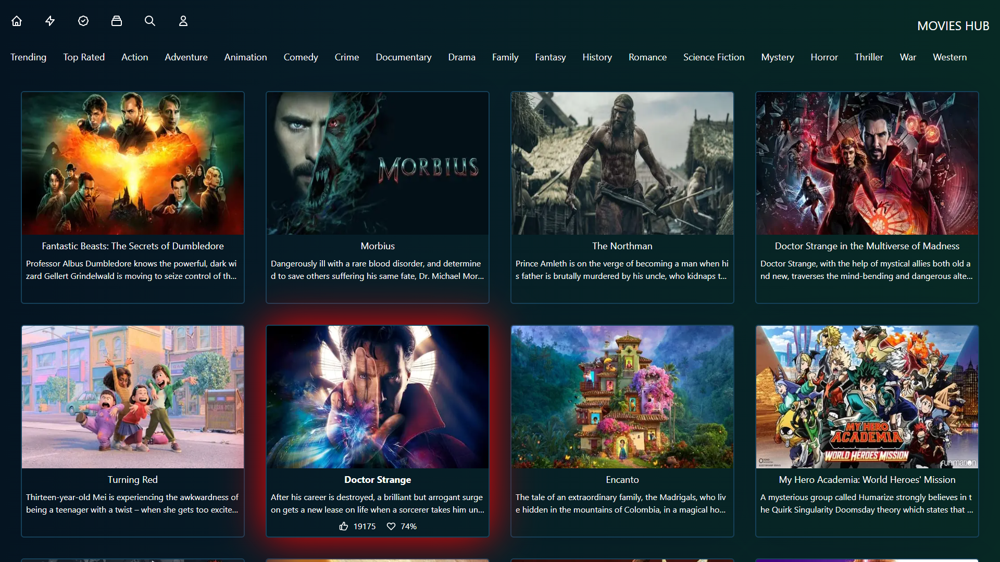

# MOVIES HUB

A responsive moive collection with different genres collected from TMDB Api.

[**Live Demo**]()
## Screenshots

<p> 
     
</p>

## Tech Stack

**Frontend** - NextJs

**Backend API** - TMDB API

**Icons** - Hero Icons

**Responsive Design** - TailwindCSS


## Run Locally

Clone the project

```bash
  git clone https://github.com/Geyanth08/Movie_Hub.git
```

Go to the project directory

```bash
  cd Movie_Hub
```

Install dependencies

```bash
  npm install
```

Start the server

```bash
  npm run dev
```


## Environment Variables

To run this project, you will need to add the following environment variables to your .env file

`API_KEY` - you can get your own API key from TMDB

TMDB Documentation - [Click Here](https://developers.themoviedb.org/3)
## API Reference

#### Get movies by Genre

```http
  GET 
  https://api.themoviedb.org/3/discover/movie?api_key=${API_KEY}&with_genres=${GENRE_ID}
```

| Parameter | Type     | Description                |
| :-------- | :------- | :------------------------- |
| `API_KEY` | `string` | **Required**. Your API key |
| `GENRE_ID`| `number` | *Optional*                 |


## Deployment Using Vercel

To deploy this project run

```bash
  npm run deploy
```


## Features

- Responsive design
- Server Side Rendering (SSR)
- Lazy Loading of Images
- Tailwind animations

*More features are loading....*


## Authors

- [Geyanth08](https://github.com/Geyanth08)


## Have Fun 🚀

If you have any feedback or suggestions, please reach out to me at geyanth.2018@gmail.com
